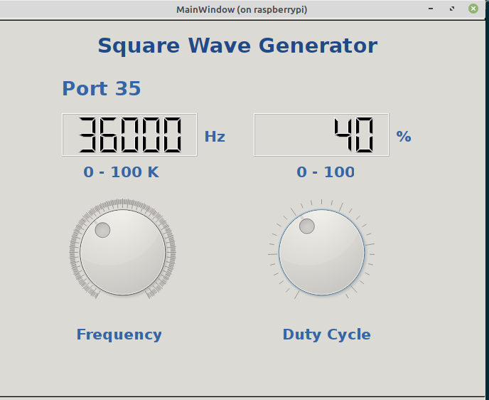
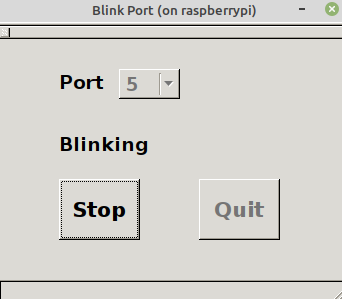

# Raspberry Pi 3

tutorial.pdf (in progress)

install\_rasperry\_os.pf

Sample programs using wiringPi library. 
Programs coded in c/c++, python and QT4.

Program to generate pulse modulation  wave (PWM) output on Port 35 

PWM:

Blink:

Program to blink Port 3

BlinkPort:

Program to blink any output Port

